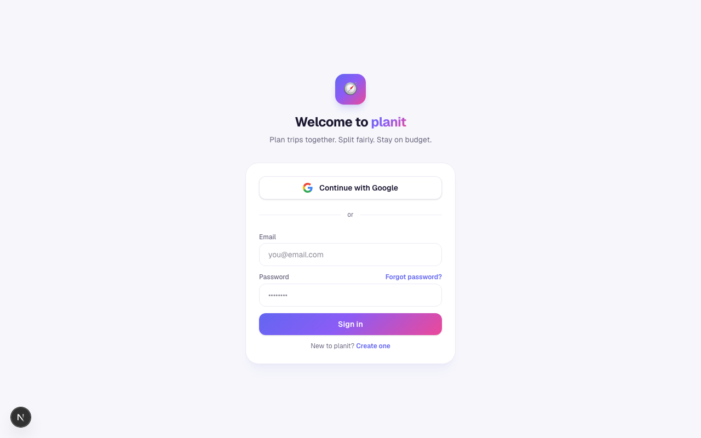

# planit

**Plan trips together. Split fairly. Stay on budget.**

planit turns the messy "who paid for what" group-trip spreadsheet into a premium, real-time app. Everyone sets their own budget, logs who covered each activity (splitting is fine), and instantly sees how the spend balances out — who's over, who's under, and how much of the shared pool is left.

## Screenshot



## Features

- **Shared budget pool + fairness** — each traveler has their own budget; live budget rings show over/under, and a fairness bar shows everyone's share of the spend.
- **Proportional settle-up** (optional per plan) — "who pays whom" to even everyone out toward their budget-proportional share.
- **Real collaboration** — invite by shareable link or email; invitees preview a plan read-only, then accept to join and edit. Anyone on the plan can add activities, log split payments, and adjust budgets.
- **Connections** — connect with people once, then add them to future plans in one tap (joining a plan auto-connects you with the host).
- **Surprise-safe plans** — mark a guest of honor and make a plan private, and it stays completely hidden from them (enforced at the database, not just the UI).
- **Profiles** — one canonical profile (name, avatar, phone with country picker, contact email) that flows into every plan you're in.
- **Auth** — Google or email/password (with forgot-password reset). Passwords are hashed by Supabase; the app never sees them.
- **Admin telemetry** — an owner-only dashboard with usage KPIs, growth charts (Chart.js), a role hierarchy (super admin → admin → user), and user block/delete.
- **Privacy** — GDPR-style self-delete that erases your planit data and unlinks you from plans while leaving the plan intact for everyone else.

## Stack

Next.js (App Router) · TypeScript · Tailwind CSS · Supabase (Postgres + RLS, Auth, Storage, Realtime) · Chart.js

## Install

```bash
git clone https://github.com/Still-InFrame/day-26-planit.git
cd day-26-planit
npm install
```

Create `.env.local` with your Supabase project credentials:

```bash
NEXT_PUBLIC_SUPABASE_URL=your-project-url
NEXT_PUBLIC_SUPABASE_PUBLISHABLE_KEY=your-publishable-key
```

Then run the dev server:

```bash
npm run dev
```

Open [http://localhost:3000](http://localhost:3000).

---

Day 26 of Savion's [100 Day AI Build Challenge](https://www.100dayaichallenge.com/share/savion) — one new app every day for 100 days.
